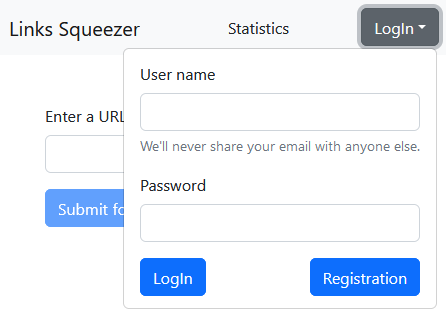
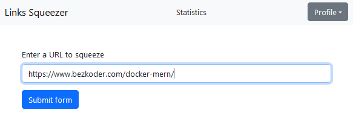
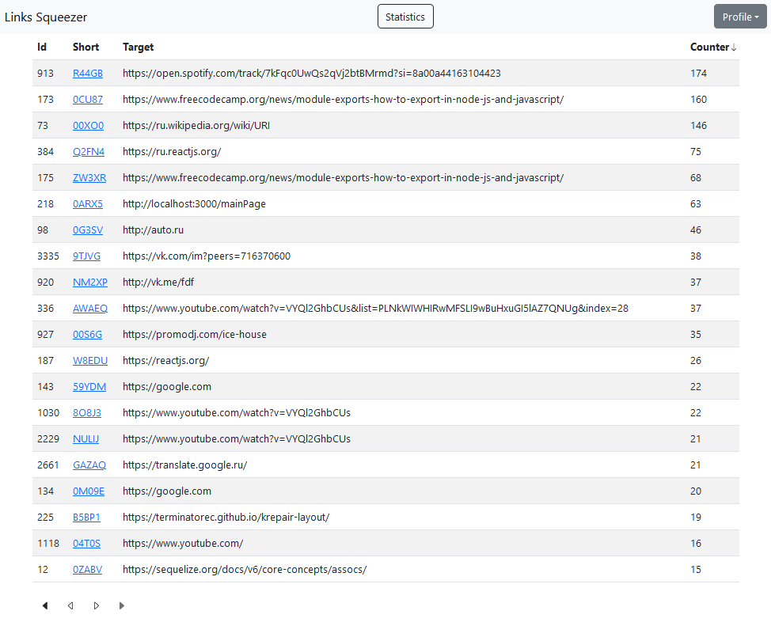

# SPA Приложение для сокращения ссылок

## Доступные скрипты

Для запуска приложения, в директории проекта выполните следующие команды:

### Установка всех зависимостей:
>### `npm install`

### Запуск самого приложения:
>### `npm start`

### Создать Docker контейнер:
>### `docker build .`

### Запустить Docker контейнер:
>### `docker run -d -p 3000:80 <image_id>`
---
### Приложение обладает следующей функциональностью:
Регистрация.<br />
После регистрации доступен следующий функционал:<br />

* можно добавить ссылку для сокращения, кнопка отправки становится доступна после предоставления валидной ссылки, например: ```(https://www.your.link/here/)```

* посмотреть статистику переходов по сокращенной ссылке
* таблица сортируется на сервере, индикация отображается стрелочкой вверх/вниз
* постраничная пагинация сервера влево/вправо/в начало

